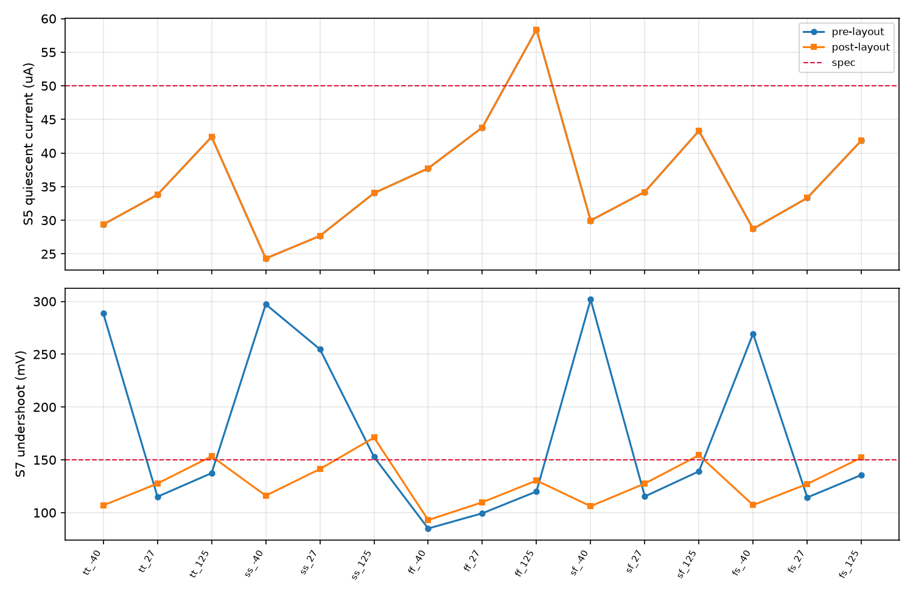

# 007 — the extracted cell outside tt / 27 °C: corners, temperature and device mismatch

**Paper(s):** none — this is a sign-off measurement, not a technique trial.
**Hypothesis:** the layout parasitics do not change the corner verdict. Every corner that fails
post-layout is a corner that already fails pre-layout at the re-certified sizing point, and the
two sub-σ matching classes (`ea_nmos_load` 0.61 σ, `bias_p_group` 1.07 σ) cost a measurable
fraction of dies out of the box.
**Control:** the **schematic** row at the same corner, re-measured here rather than copied from
[003](../003-sizing/README.md) — 003's corner sweep is at the *old* sizing point (Iq 36.28 µA) and
the re-certified cell (`bf3a4f8`, Iq 33.81 µA) had never been run at corners by either lane. Both
rows come out of the same frozen path (`ldo.sim.run` + `ldo.metrics.promote`), same 13 benches,
same spec definitions; the only difference between them is the DUT block.
**Verdict:** **FALSIFIED in the interesting direction, twice.**

1. The parasitics do change the corner verdict — **in both directions**. At **125 °C** they take
   S7 out of the box in **four of five corners** where only one fails pre-layout. At **−40 °C**
   they *rescue* it: the schematic row undershoots 269–302 mV at every cold corner and the
   extracted row 106–116 mV, and §3 names the capacitance responsible.
2. The two sub-σ classes do **not** cost yield at tt/27 on the extracted cell: neither leaves the
   spec box out to the ±3 σ the brief prices them at (the box edges are at 9.1 σ and 17.9 σ), and
   §4 gives the measured distance instead of an estimate. The brief's cliff is not an error — §4
   reproduces it on the same block with the extracted capacitance deleted, and shows that one
   net, `ea_o1`, is what removes it.

Everything below is measured on **`layout/ldo_ihp_capless/asbuilt/core_pex.sp`**, the committed
**CC** extraction (sha256 `f89e0105cc5462cf…`), spliced into the cell's own frozen benches. The
CC netlist is the right one for this: the RC mesh carries values that are not usable in a bench
(REPORT §5), and CC is ~4× cheaper. Cost of the whole experiment: **≈ 1.9 cpu-h** (30 corner rows
at 19 s pre / 71 s post, 12 mismatch rows, 13 threshold rows, 9 control rows).

```
LDO_EXP=007 LDO_JOBS=12 uv run --no-sync python experiments/007-post-layout-corners/run.py --stage corners
                                                                                  ... --stage mismatch
                                                                                  ... --stage threshold
                                                                                  ... --stage control --control-dvt 0,2,15
                                                                                  ... --stage tables
```

## 1. Grid

Five MOS corner bundles × three temperatures, i.e. the grid 003 used: `tt` `ss` `ff` `sf` `fs`
(each bundle also selects its `cornerRES` / `cornerCAP` section — `corners.yaml`) × −40 / 27 /
125 °C, all 13 benches, both rows. **`tt_27 post` reproduces `layout/ldo_ihp_capless/
scorecard_post.json` at every digit and `tt_27 pre` reproduces the certified pre-layout row** —
that is the control on the harness itself, checked before anything else was read.

| spec | bound | worst pre-layout | at | worst post-layout | at | pre at the post worst | post - pre there |
|---|---|---|---|---|---|---|---|
| S1 regulated output, Vin 1.5 V, no load | in 1.176..1.224 V | 1.197 | ff_125 | 1.197 | ff_125 | 1.197 | 0 |
| S2 load regulation, 0.1 -> 10 mA | <= 5 mV | 0.054 | ff_125 | 0.054 | ff_125 | 0.054 | 0 |
| S3 line regulation, Vin 1.4 -> 1.65 V | <= 2 mV | 0.266 | ff_125 | 0.266 | ff_125 | 0.266 | 0 |
| S4 dropout at 10 mA | <= 200 mV | 131.8 | ss_125 | 131.8 | ss_125 | 131.8 | 0 |
| S5 quiescent current, no load | <= 50 uA | 58.37 | ff_125 | 58.37 | ff_125 | 58.37 | -1e-05 |
| S6 PSRR at 1 kHz, 1 mA | >= 40 dB | 59.02 | ff_125 | 59.02 | ff_125 | 59.02 | 0.00405 |
| S7 load-step undershoot, 0.1 -> 10 mA | <= 150 mV | 301.8 | sf_-40 | 171.1 | ss_125 | 152.8 | 18.33 |
| S8 loop phase margin at 1 mA | >= 60 deg | 70.37 | ff_125 | 67.61 | ff_125 | 70.37 | -2.754 |

| corner | `v_out_v` | `load_reg_mv` | `line_reg_mv` | `v_dropout_mv` | `i_q_ua` | `psrr_1k_db` | `v_undershoot_mv` | `pm_loop_deg` | box |
|---|---|---|---|---|---|---|---|---|---|
| tt_-40 pre | 1.2 | 0.016 | 0.031 | 95.89 | 29.38 | 73.84 | **288.7** | 72.7 | FAIL (1) |
| tt_-40 post | 1.2 | 0.016 | 0.031 | 95.87 | 29.38 | 74.02 | 106.9 | 69.28 | PASS |
| tt_27 pre | 1.199 | 0.026 | 0.056 | 104.7 | 33.81 | 70.01 | 115.1 | 72.51 | PASS |
| tt_27 post | 1.199 | 0.026 | 0.056 | 104.7 | 33.81 | 70.09 | 127.6 | 69.3 | PASS |
| tt_125 pre | 1.198 | 0.047 | 0.169 | 114.5 | 42.4 | 62.46 | 137.4 | 71.21 | PASS |
| tt_125 post | 1.198 | 0.047 | 0.169 | 114.5 | 42.4 | 62.48 | **153.3** | 68.54 | FAIL (1) |
| ss_-40 pre | 1.201 | 0.015 | 0.029 | 109.5 | 24.32 | 72.43 | **297.3** | 73.54 | FAIL (1) |
| ss_-40 post | 1.201 | 0.015 | 0.029 | 109.5 | 24.32 | 72.64 | 116.1 | 70.28 | PASS |
| ss_27 pre | 1.2 | 0.027 | 0.049 | 120.2 | 27.68 | 69.11 | **254.8** | 73.5 | FAIL (1) |
| ss_27 post | 1.2 | 0.027 | 0.049 | 120.2 | 27.68 | 69.22 | 141.3 | 70.4 | PASS |
| ss_125 pre | 1.199 | 0.048 | 0.142 | 131.8 | 34.05 | 63.13 | **152.8** | 72.19 | FAIL (1) |
| ss_125 post | 1.199 | 0.048 | 0.142 | 131.8 | 34.05 | 63.16 | **171.1** | 69.62 | FAIL (1) |
| ff_-40 pre | 1.2 | 0.016 | 0.026 | 78.24 | 37.72 | 76.19 | 84.99 | 71.92 | PASS |
| ff_-40 post | 1.2 | 0.016 | 0.026 | 78.22 | 37.72 | 76.36 | 93 | 68.33 | PASS |
| ff_27 pre | 1.199 | 0.025 | 0.051 | 85.11 | 43.81 | 71.7 | 99.39 | 71.49 | PASS |
| ff_27 post | 1.199 | 0.025 | 0.051 | 85.11 | 43.81 | 71.77 | 109.8 | 68.19 | PASS |
| ff_125 pre | 1.197 | 0.054 | 0.266 | 91.63 | **58.37** | 59.02 | 120 | 70.37 | FAIL (1) |
| ff_125 post | 1.197 | 0.054 | 0.266 | 91.63 | **58.37** | 59.02 | 130.4 | 67.61 | FAIL (1) |
| sf_-40 pre | 1.2 | 0.015 | 0.03 | 85.83 | 29.97 | 74 | **301.8** | 72.77 | FAIL (1) |
| sf_-40 post | 1.2 | 0.015 | 0.03 | 85.81 | 29.97 | 74.18 | 106.1 | 69.36 | PASS |
| sf_27 pre | 1.2 | 0.025 | 0.053 | 94.56 | 34.22 | 70.23 | 115.3 | 72.49 | PASS |
| sf_27 post | 1.2 | 0.025 | 0.053 | 94.56 | 34.22 | 70.32 | 127.6 | 69.28 | PASS |
| sf_125 pre | 1.198 | 0.04 | 0.169 | 102.4 | 43.31 | 63.16 | 139.1 | 71.06 | PASS |
| sf_125 post | 1.198 | 0.045 | 0.153 | 102.4 | 43.31 | 63.18 | **154.4** | 68.39 | FAIL (1) |
| fs_-40 pre | 1.2 | 0.016 | 0.029 | 101.9 | 28.73 | 74.07 | **269.4** | 72.75 | FAIL (1) |
| fs_-40 post | 1.2 | 0.016 | 0.029 | 102 | 28.73 | 74.25 | 107.2 | 69.32 | PASS |
| fs_27 pre | 1.199 | 0.026 | 0.055 | 110.8 | 33.32 | 70.17 | 114.3 | 72.61 | PASS |
| fs_27 post | 1.199 | 0.026 | 0.055 | 110.8 | 33.32 | 70.26 | 127.2 | 69.4 | PASS |
| fs_125 pre | 1.198 | 0.05 | 0.203 | 122.8 | 41.87 | 61.09 | 135.7 | 71.49 | PASS |
| fs_125 post | 1.198 | 0.05 | 0.203 | 122.8 | 41.87 | 61.11 | **152.1** | 68.8 | FAIL (1) |

## 2. What the corners say

**S5 fails at ff/125 in both rows, by the same 58.37 µA against a 50 µA line.** It is identical
pre and post to five digits, so it is a **schematic-level** corner failure, not a layout one —
003 §3 already recorded S5 binding at ff/125 and the re-certification did not move it. Nothing
in the layout lane can fix it.

**S7 leaves the box at 125 °C in four of five corners post-layout** (152.1–171.1 mV against
150 mV) where pre-layout only `ss_125` does (152.8 mV). The mechanism is the one the brief and
REPORT §6 already price at tt/27: the extraction adds 34.45 fF to `gate`, worth ~10 mV of
undershoot, and at 125 °C the pre-layout margin is only 10.9–14.3 mV. This is the number PLAN
§6b ruling 1 was missing: **S7's real constraint is temperature, not the `gate` budget** — at
tt/27 the net still has +46 fF of headroom (REPORT §6.1), and at 125 °C it has none.

**S8 never binds**: the worst post-layout phase margin over the whole grid is 67.61° at ff/125,
7.6° above the line, and the pre→post drop is a steady ≈ 2.8–3.6° at every corner.



## 3. −40 °C: the parasitics rescue the cold corner, and one net does it

The most surprising row in the grid is the cold one: the **schematic** cell undershoots
**288.7 / 297.3 / 301.8 / 269.4 mV** at tt / ss / sf / fs at −40 °C — out of the box by a factor
of two — while the **extracted** cell is at **106.9 / 116.1 / 106.1 / 107.2 mV**. Recovery time
moves with it, 0.87 → 0.20 µs.

That is a claim about capacitance, so it is settled by deleting capacitance (`layout/
postlayout.py --keep-c/--drop-c/--no-c`, which removes only `Cext_` cards and writes to its own
directory), all at tt/−40:

| extraction with… | S7 (mV) | reads |
|---|---|---|
| **no** extracted C | 288.62 | = the schematic row (288.75) — the control closes |
| `gate` C only | 279.68 | the net the budget is about does almost nothing here |
| `vout` C only | 282.98 | nor does the output net |
| **`ea_o1` C only** | **89.41** | the whole effect, from one net |
| `ea_out` C only | 93.23 | |
| `fb` C only | 93.38 | |
| everything except `gate` | 92.63 | |
| **all** extracted C | **106.89** | the committed post-layout row at this corner |

So the cold-corner recovery is bought by ~44 fF of drawn, undesigned capacitance on the
error-amp output node `ea_o1` (and the neighbouring `ea_out` / `fb` do the same job), and the
34.45 fF on `gate` costs ~14 mV back. **This is the evidence behind PLAN §6b ruling 1 option 3**:
the cell's transient behaviour at cold depends on a capacitor nobody sized. Certifying it would
turn a layout artefact into a design parameter.

## 4. Mismatch: σ-injection, and why not a Monte Carlo

**Method.** A class offset is a dc source in series with the gate of **every extracted card the
design device is drawn as** — the re-certified netlist splits each MOS into two half-width cards,
and `run.py` finds them by (model family, drain net, gate net, source net) and asserts the count,
because the extraction carries no design-device names. This is BRIEF.md §6b's own method, so the
numbers are comparable with the brief's. The platform's `inject_vsource` makes the device see
`net + dv`, so a threshold *increase* of ΔVT is injected as a gate source of −ΔVT.

| class | injected on | k sigma | dVT (mV) | S7 (mV) | S6 (dB) | S1 (V) | box |
|---|---|---|---|---|---|---|---|
| `bias_p_group` | `XMT` (1 card) | -3 | -3.3540 | 127.3 | 70.12 | 1.2 | PASS |
| `bias_p_group` | `XMT` (1 card) | -2 | -2.2360 | 127.4 | 70.11 | 1.2 | PASS |
| `bias_p_group` | `XMT` (1 card) | -1 | -1.1180 | 127.5 | 70.1 | 1.2 | PASS |
| `bias_p_group` | `XMT` (1 card) | +1 | +1.1180 | 127.7 | 70.08 | 1.199 | PASS |
| `bias_p_group` | `XMT` (1 card) | +2 | +2.2360 | 127.8 | 70.07 | 1.199 | PASS |
| `bias_p_group` | `XMT` (1 card) | +3 | +3.3540 | 127.9 | 70.05 | 1.199 | PASS |
| `ea_nmos_load` | `XM3` (2 card) | -3 | -4.9404 | 127.3 | 64.01 | 1.191 | PASS |
| `ea_nmos_load` | `XM3` (2 card) | -2 | -3.2936 | 127.4 | 65.72 | 1.194 | PASS |
| `ea_nmos_load` | `XM3` (2 card) | -1 | -1.6468 | 127.5 | 67.74 | 1.197 | PASS |
| `ea_nmos_load` | `XM3` (2 card) | +1 | +1.6468 | 127.6 | 72.44 | 1.202 | PASS |
| `ea_nmos_load` | `XM3` (2 card) | +2 | +3.2936 | 127.7 | 73.38 | 1.205 | PASS |
| `ea_nmos_load` | `XM3` (2 card) | +3 | +4.9404 | 127.8 | 71.85 | 1.208 | PASS |

| class | 1 sigma dVT | in box up to | out of box from | first spec line out | threshold / sigma | one-sided P(out of box) |
|---|---|---|---|---|---|---|
| `bias_p_group` | 1.1180 mV | 19.3750 mV | 20.0000 mV | S7 | 17.889 | **7.2e-70 %** |
| `ea_nmos_load` | 1.6468 mV | 14.3750 mV | 15.0000 mV | S1 | 9.109 | **4.2e-18 %** |

### The brief's cliff is real — the drawn capacitance removes it

The brief prices `ea_nmos_load` at 0.61 σ because +2.0 mV of ΔVT on `XM3` takes the cell out of
the box; on the extracted cell nothing leaves the box out to +14.4 mV. Two readings fit that:
the extracted capacitance damps the class, or the injection is not equivalent to the brief's.
The control holds the injection fixed and changes only which `Cext_` cards are in the block:

| extracted C kept | dVT on `XM3` (mV) | S1 v_out (V) | S7 undershoot (mV) | box |
|---|---|---|---|---|
| allC | +0 | 1.199 | 127.6 | PASS |
| ea_o1 | +0 | 1.199 | 106.9 | PASS |
| noC | +0 | 1.199 | 115.1 | PASS |
| allC | +2 | 1.203 | 127.6 | PASS |
| ea_o1 | +2 | 1.203 | 107 | PASS |
| noC | +2 | 1.203 | 198 | **FAIL** (S7 load-step undershoot, 0.1 -> 10 mA) |
| allC | +15 | 1.224 | 128.1 | **FAIL** (S1 regulated output, Vin 1.5 V, no load) |
| ea_o1 | +15 | 1.224 | 107.9 | **FAIL** (S1 regulated output, Vin 1.5 V, no load) |
| noC | +15 | 1.224 | 277.3 | **FAIL** (S1 regulated output, Vin 1.5 V, no load; S7 load-step undershoot, 0.1 -> 10 mA) |

At **+2.0 mV the cliff reproduces exactly as the brief has it — but only with the extracted
capacitance removed** (S7 198.0 mV, out of the box). The whole `Cext_` set brings it back to
127.6 mV, and **the single net `ea_o1` is enough** (107.0 mV), which is the same net §3 finds
buying the cold-corner recovery. So the injection is equivalent and the brief is right about the
schematic; the drawn cell is simply not the circuit the brief priced. The +15 mV row is the
measured box edge from the bisection below, and it fails on **S1** (dc offset), not S7 — by then
the offset, not the transient, is what leaves the box.

**Why not a Monte Carlo.** The PDK ships `sg13g2_moslv_mismatch.lib`, but selecting it means
adding a `lib_file`/`section` line to `circuits/ldo_ihp_capless/pdk/ihp-sg13g2/corners.yaml` —
a **certified** file that belongs to the schematic lane and whose hash is in `decks/*/SHA256SUMS`.
Changing it here would re-freeze the decks from the layout lane, which rule 2 forbids. The
injection above measures the same thing the distribution's tail would: the distance from the
nominal point to the box edge, in units of the PDK's own σ.

## 5. What this experiment does not answer

- **The distribution.** σ-injection gives the box edge, not the yield of a full random draw over
  all classes at once. The one-sided figures above are normal tails on one class each.
- **Corners × mismatch.** Both stages of the mismatch work are at tt/27. At 125 °C S7 is already
  out of the box, so the interesting question is a *joint* one and it is not answered here.
- **The RC netlist.** Every row here is CC — the corner grid is 30 × 13 benches and CC is ~4×
  cheaper. The stitched RC netlist now measures (REPORT §5, `scorecard_post_rc.json`), and at
  tt/27 it differs from CC on one spec line only: S4 dropout 104.7 → 134.7 mV (+30.0 mV, the
  drawn IR drop at 10 mA). The lines this grid finds binding — S5 and S7 — move 0.04 µA and
  1.9 mV between CC and RC, so the CC grid stands for them. S4's worst corner here is ss/125 at
  131.8 mV; 131.8 + 30 = 161.8 mV is still inside the 200 mV bound, but that is an **addition,
  not a measurement** — the RC grid was not run.
- **Supply corners.** The grid is process × temperature; the benches set their own supply.

## Lessons to graduate

- *A cell can depend on a capacitor nobody drew on purpose* — `ea_o1`, §3, and it is the same
  net that hides the brief's mismatch cliff in §4. Ledger tags `007_attr_*`, `007_ctl_*`.
- *A mismatch result that does not reproduce a brief needs the brief's condition as its control*,
  not an argument: deleting the extracted C put the cliff back at the mV the brief named.
- *A corner sweep needs its own control at the same sizing point*: 003's corner table is at a
  sizing point that no longer exists, and copying it would have hidden that S5/ff/125 is a
  schematic failure, not a layout one. Ledger tags `007_<corner>_<temp>_{pre,post}`.
