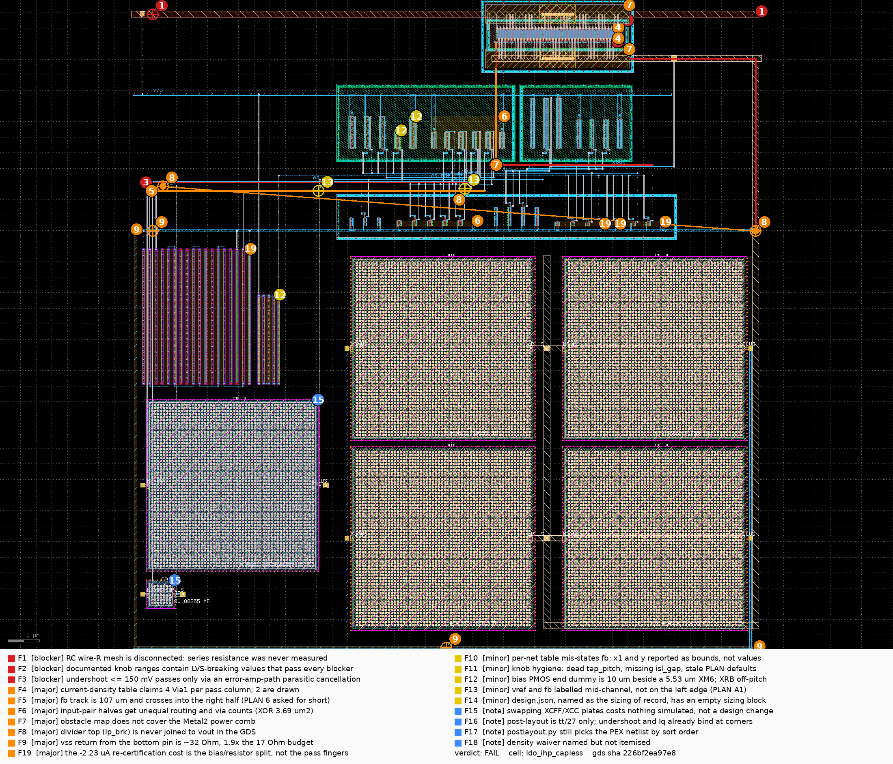

# Layout review — `ldo_ihp_capless`, second drawing (`feat/001-reference` @ 6bd5aba)

**KIND: REVIEW.** Independent gate for the layout of record. Everything below was re-derived: the
GDS rebuilt from the committed `layout/gen_ldo.py`, DRC / LVS / kpex CC / kpex RC re-run by this
reviewer, all 13 frozen benches re-measured on this reviewer's own extraction, and every geometry
number read out of the GDS with KLayout. No number here is quoted from the designer's logs. I did
not write this generator.

Per-finding zooms: [`review_crops/`](review_crops/). Machine-readable twin, with every anchor in
µm of GDS coordinates: [`REVIEW.yaml`](REVIEW.yaml) (`layout-review/1`, validates).

## Verdict — **FAIL**

The drawing itself is good and the four `review-002` findings it was written to close are closed:
the 10 mA path is off Metal1, the matched classes are common-centroid with tied dummies inside
five closed guard rings, the LVS reference is derived from the certified netlist, and the Metal1
obstacle map has a regression test that fails without it. Build, DRC, LVS and all 18 scorecard
numbers reproduce exactly. The FAIL is not about the pixels; it is about three claims that do not
survive re-measurement.

1. **The RC extraction never put wire resistance into the circuit.** All 8 397 `Rext_` cards sit
   on a 6 105-node mesh that shares **not one node** with any device or capacitor. Forced to
   converge with `rshunt`, the RC netlist returns the CC row to five digits — because R is not in
   it. So the brief's own "tightest budget in the brief" (`vout` 1.78 Ω, `vdd` 1.77 Ω, `vss` 17 Ω)
   is measured by nothing, in either mode. My hand model from the drawn TopMetal1 puts vdd + vout
   at ≈ 2.2 Ω, worth ≈ +28 mV of dropout that both scorecards report as zero (F1).
2. **Documented knob ranges produce a cell that is not the certified circuit, and every blocking
   stage says yes.** `xmp_nf_mult = 3` — the documented *minimum* — draws a 189.81 µm pass device
   against a certified 190 µm and fails LVS with DRC 0 and current density 0.975×; 6 and 7 do the
   same. `col_vias = 3` and `= 4` (the documented *maximum*) extract `gate|vout` as one net.
   Only `guards` and `current_density` block in `layout/signoff.py` (F2).
3. **The load-step undershoot margin is a cancellation.** With only the `gate` net's extracted
   capacitance present and every other parasitic zeroed, S7 = **204.5 mV against a ≤ 150 mV spec**.
   The delivered 127.6 mV comes back from parasitics on the error-amp path, and each of `ea_o1`,
   `ea_out` and `fb` **alone** recovers ~76–80 mV of it (measured), so it is one saturating
   mechanism, not the per-fF credit REPORT §6 banks — a credit brief §3 note 4 says in terms must
   **not** be taken from incidental routing (F3).

Everything in the box still passes at tt/27 on the full extraction. That is true and it is not the
question: the question is whether the numbers mean what the report says they mean, and on these
three they do not.

## Findings

| # | severity | where (net / device / rule) | evidence | effect | fix → generator parameter | expected |
|---|---|---|---|---|---|---|
| **F1** | blocker | `vdd` / `vout` TopMetal1 straps; pins (−62.5, 69.55) and (131.0, 0.0) | RC netlist: 8 397 `Rext_` cards, 6 105 mesh nodes named `<net>.$x.y`; intersection with the 33 device-terminal nodes and the 34 capacitor nodes is **empty**. With `.option rshunt=1e12` RC runs 13/13 and returns the CC row to 5 digits (dropout 104.654, PM 68.76212, S7 127.580, Iq 33.8056); CC with the same option is identical. Without it, 6/13 converge (REPORT says 2/13) and the DC ones return load_reg 2.849 mV, line_reg 8.181 mV — nonsense. | `v_dropout_mv` **+28.5 mV** (hand model: 125 µm and 114 µm of 2.0 µm TopMetal1 at the PDK's 18 mΩ/sq ⇒ 1.13 Ω on `vdd`, 1.03 Ω on `vout`, × brief §4's 13.24 / 13.21 mV/Ω). ≈ 30 % of the remaining dropout margin, reported as zero. | **new feature** — make the extractor's mesh reach the device pins, or drop the RC claim and carry the hand model. Interim: `pwr_w` 2.0 → 4.0 µm halves both (TopMetal1 has 3× EM headroom). | 2.2 Ω → 1.1 Ω; dropout +28 mV → +14 mV |
| **F2** | blocker | `LayoutParams.BOUNDS`, `gen_ldo.py:120–128`; XMP island (44.88, 57.83)–(89.94, 67.73) | Built every knob at both range ends. `xmp_nf_mult=3` (min): 190/57 = 3.33 µm/finger, extracted `W=189.81u` vs certified `190u`, **LVS mismatch**, DRC 0, CD 0.975× — same for 6 and 7. `col_vias=3` and `=4` (max): extracted `gate|vout`, **LVS mismatch**, DRC 0, CD 0.836×. `rail_w=2.0` (max) and `rb_segs=6` (max) do not build. `n_dummy=0` (min): DRC 1 × M1.b. `pwr_band_w=5.0` (min): CD 1.0032× (fails). | 5 of 10 tested in-range values give a cell that is not the certified circuit; only `guards` and `current_density` raise in `layout/signoff.py`. | `BOUNDS`: `xmp_nf_mult` {4,5,8}, `col_vias` (1,2), `rail_w` (0.5,1.6), `rb_segs` {1,2,5}, `n_dummy` (1,2), `pwr_band_w` (5.1,12.0); **add the grid assert** the resistors already have (`_seg_len`) to the pass-device finger width; make DRC + LVS blocking. | no in-range value produces a shorted or mis-sized cell |
| **F3** | blocker | `gate`: Metal1+GatPoly bar (46.94, 60.33)–(86.785, 60.83), Metal3 hop x = 47.73, track y = 21.23; `ea_o1` track y = 15.63 | What-ifs on my CC subckt through the frozen benches: all parasitics 127.581 mV · no parasitics 115.065 · **`gate` only 204.495 (violates ≤ 150 mV)** · everything but `gate` 109.237. Adding one net back to the gate-only case: `ea_o1` **124.682**, `ea_out` **129.124**, `fb` **128.590**, all three 121.882 — each alone recovers ~76–80 mV and together they recover barely more, i.e. one saturating mechanism on the `ea_o1`→`ea_out`→`gate` path, not the linear per-fF sum REPORT §6 takes −12 mV from. | `v_undershoot_mv` **+89.4 mV** (what-if). Measured `gate` C scaling over three PEX runs: 36.10 fF @ `xmp_nf_mult`=2, 47.49 @ 4, 70.83 @ 8 → **5.8 fF per unit** from the 38.75 µm gate bar on a 24 fF fixed remainder; the B1 fix (1→4) cost ≈ 17 fF, 58 % of the whole 29.3 fF budget. | **new feature** — drive the pass gate from a Metal2/Metal3 bus over the array and expose `GPAD` (hard-coded 0.5) as a knob. `xmp_nf_mult` = 2 alone puts `gate` back in budget (26.5 fF to rail) but leaves the column 1.46× over EM, so it is not a fix on its own; and `xmp_nf_mult` = 8, legal today, gives 70.8 fF total / 51.3 fF to rail — unsafe when 34.5 fF to rail already gives 204 mV. | `gate` to-rail below ~30 fF; it is 34.5 fF now, 51.3 fF at the top of the range |
| **F4** | major | pass-array Via1 rows y = 65.14 (source) and 61.52 (drain), x 47.88–86.94 | `gen_ldo.py:747–748` emits `n_vias = col_vias**2` = 4; `:737/:741` call `via_row(n=col_vias, rows=col_vias)`, which draws 2. Counted in the GDS: 77 S/D columns, **exactly 2 Via1 each** (155 cuts in the band). Also: no budget row at all for the vdd-side diffusion contacts, and the contact count is asserted as 4 where the PDK cell draws **7** per column. | Two rows of the 27-row table are wrong by 2× (`via1 ×4, 0.165×` should read `via1 ×2, 0.329×`). Verdict unchanged — the worst segment is the Metal2 comb spine at 0.836× — but the stage that exists *because* it reads the drawn geometry does not, here. | `gen_ldo.power_budgets`: `n_vias = p.col_vias`; better, count the cuts out of the built `Component`. | table right, worst stays 0.836× |
| **F5** | major | `fb` Metal1 track (−62.89, 12.83)→(44.26, 12.83); divider (−66, −49.5)–(−31.1, −5.78); XM1a/XM1b | PLAN §6 requires `fb` to be "a **short** track … kept off the right half entirely". Measured: **107.15 µm**, 53 % of the cell width, ending at x = +44.26 where the cell midpoint is +31.75. Second-longest signal track in the cell. Cause: the divider is bottom-left for thermal reasons while `ea_in_pair` is the *second* group in `ROW_B_QUIET` (x 26.7–50.4). | `pm_loop_deg` **−2.85°** (what-if: `fb`-only parasitics). | **new feature** — swap `bias_p_group` and `ea_in_pair` in `ROW_B_QUIET`. `bias_p_group` has 7.16 σ and no routing constraint; it is the group that should take the long trip. Shortens `fb` ≈ 22 µm. A/B this alone. | `fb` 34.0 → ~27 fF, PM 68.76 → ~69.3° |
| **F6** | major | `ea_in_pair` (26.69, 26.16)–(50.39, 36.78); XM1 halves x 31.97/45.11, XM2 halves 36.35/40.73 | REPORT §8.3 says "not matched half-for-half … Not measured". Measured, by translating one half's local window (±2.4 µm, Metal1+Metal2+Via1+Metal3) onto the other and XORing: XM1 **XOR 3.69 µm² of 5.71 (64.7 %)**, XM2 **XOR 2.54 µm² of 7.74 (32.8 %) with 4 vs 3 Via1**. `ea_nmos_load` under the same test: **XOR 0.000 µm², 2 vs 2 Via1** — so the generator can do it, and does, for the 2.10 σ class but not the 1.85 σ one. Device geometry is correct: ABBA, both centroids at x = 37.64, all instances `r0`, tied dummies both ends. | Not simulable — routing asymmetry perturbs the etch/stress environment the compact models do not carry. Measured proxy: drain-node imbalance `ea_n` 17.72 fF vs `ea_o1` 64.91 fF. | **new feature** — reserve a mirrored column pair per common-centroid member before the general allocator runs. | XOR → 0 µm² and equal via counts, as XM3/XM4 already show |
| **F7** | major | `gate` Metal3 hop x = 47.73, y 21.08→60.73; Metal2 comb spines y = 55.33 and 69.55, x 44.28–90.54 | `router.ObstacleMap.column_free` tests only the verticals the router registered; the pass array's Metal2 comb (fingers + two 6 µm spines) is drawn with `rect`/`h` and **never registered**. That is the hole that produced the it02→it03 `gate|vout` short, and it is closed for `gate` only, by the hard-coded `to_track_m3` at `gen_ldo.py:788`. `col_vias` ∈ {3, 4} reproduces the same short today (F2). `layout/test_builder.py` — the M8 regression — covers Metal1 only. | one silent short class, reproduced at two in-range knob values | register every drawn Metal2 rectangle in `ObstacleMap.verticals`; add the Metal2 case to `layout/test_builder.py` as M8's Metal1 case was added. | `col_vias` 3/4 either match or fail loudly at build time |
| **F8** | major | `lp_brk` label (−59.275, 14.23) ↔ `vout` pin (131.0, 0.0) | Brief §4 calls the sense tap "the tightest budget in the brief and … a floorplan decision": 0.126 Ω at the pass drain vs 1.78 Ω at the pin, 14×. REPORT §7 says the tap is at the pin "by construction". It is **not drawn at all** — `lp_brk` is a separate pin of the extracted cell and `layout/postlayout.py` re-inserts `VLP lp_brk vout` onto the flat `vout` node. With CC there is one `vout` node, so the choice is invisible; with a working RC it decides between the two budgets. | `load_reg_mv` **+10.2 mV** (hand: 9.9 mV/Ω × 1.03 Ω) *if* the integrator taps at the drain — against a ≤ 5.0 mV spec line. | **new feature** — draw the tap to the TopMetal1 strap at the pin end so LVS sees one net, or put it in the cell's interface contract explicitly. | S2 is either 0.026 mV or ~10 mV; the GDS does not currently say which |
| **F9** | major | vss bottom rail (−68.9, −134.4)–(132.4, −133.6); riser (−68.5, −134.4)–(−67.7, 0.4); labels (31.75, −134.0) and (−62.5, 0.0) | The bottom-edge vss rail reaches the cell rail through **one** 0.8 µm Metal1 vertical 134.8 µm long. At the PDK's 110 mΩ/sq that is 18.5 Ω, plus 13.7 Ω along the bottom rail from the `vss` label ⇒ **≈ 32 Ω** against the brief's 17 Ω budget (PSRR −0.4413 dB/Ω). Not in the current-density table (27.7 µA is EM-safe) and not in either scorecard (CC has no R). The cell also carries **two** `vss` labels, so which one is the pin — and therefore what the return resistance is — is ambiguous. | `psrr_1k_db` **−14 dB** (hand model). 30 dB of margin, so nothing breaks; the net is 1.9× over a measured budget. | `rail_w` → 2.0 (blocked today by F2), or stitch the bottom rail up both edges, or delete the bottom-edge label and declare one vss pin. | 32 Ω → ~8 Ω, inside budget |
| **F19** | major | `bias_n_group` (66.54, 1.42)–(102.18, 2.88), `XMB0` halves at x 81.08 and 85.96; divider serpentine (−66.0, −49.5)–(−31.1, −5.78) | REPORT §2 and §10.2 charge the whole re-certification cost to the pass device ("a generator-legalized **finger split** is a sizing change … it moves Iq by −2.23 µA"); §6 column 3 lumps all three splits into one row, so the attribution is never tested. Four one-group what-ifs on the **certified** deck, zero parasitics: `XMP` as `m=76` at constant W → Iq **36.29192 (+0.015 µA)**, S7 104.696; bias branch `XMB0`/`XMB1`/`XMS` halved → Iq **34.03716 (−2.240 µA)**, S7 110.937 (+6.09 mV); EA pairs halved → Vout **1.199502 (−0.570 mV)**; `XR1`/`XR2`/`XRB` segmented → Iq 36.07702 (−0.200 µA), S7 107.728 (+2.88 mV). Sums recover −2.42 of −2.47 µA, −0.574 of −0.573 mV, +8.8 of +10.2 mV. | `i_q_ua` **−2.24 µA** from the bias halving alone (what-if); the 76-finger pass array is **+0.015 µA** — free to three digits. | `circuits/…/netlist.spice`: half-width cards for the matched members, segment strings for the resistors, `nf` on `XMP`. The ruling is unchanged; the *reason* is. | re-certified Iq ≈ 33.8 µA, and reverting `xmp_nf_mult` buys back 0.015 µA, so it is not a trade |
| **F10** | minor | nets `fb`, `x1`, `y` | My per-net table: `fb` 33.97 fF total but **24.05 fF to a rail** (VSUBS 21.73 + vss 1.95 + vdd 0.37); the brief's −0.111 °/fF is a to-rail coefficient and the measured `fb`-only cost is −2.85°, matching 24.05 × 0.111 = −2.67° and not the raw 34.0 × 0.111 = −3.77° the REPORT quotes. So `fb` is **0.86× of budget, not 1.22×** — the REPORT is conservative here, but it uses raw-total accounting for `fb` and to-rail accounting for `gate` in one table. `x1` and `y` read "< 17.7" only because `layout/signoff.py:pex` keeps the top twelve nets (`[:12]`); they are **11.28 fF** and **11.50 fF**. | 0.9° of the reported phase-margin attribution | `layout/signoff.py`: keep every net; state one accounting convention for the table. | `fb` 0.86×, `gate` 1.18× to-rail; `x1` 0.24×, `y` 0.19× |
| **F11** | minor | `LayoutParams` | `tap_pitch` at 6.0 and at 18.0 gives a GDS **byte-identical** to the default (sha 226bf2ea…) — its own comment says "unused by the rings". `isl_gap` is a real knob absent from PLAN §5. PLAN §5 lists `ring_gap` 1.2 / `r_segs` 4 / `rb_segs` 2 against committed 1.4 / 8 / 5, and `xmp_nf_mult` (1,8) against `BOUNDS` (3,8). PLAN §1 says `ea_in_pair` is "2 instances of `nf` = 2"; the slots are `(XM1, 0.5, 1)` — two single fingers of 4.765 µm. `GPAD` 0.5, `GATE` 1.5, `STRAP` 0.5, `W_M1` = `W_M2` = 0.2, `VPAD` 0.38 set the parasitics an optimizer must trade and are module constants. | one dead search dimension; a stale plan | drop `tap_pitch`; add `isl_gap`, `gpad`, `w_m1`, `w_m2`; generate PLAN §5 from the dataclass. | plan and dataclass agree; every listed knob moves the GDS |
| **F12** | minor | XM6 (14.93, 26.16)–(17.23, 32.31), its dummy (19.81, 26.16)–(22.11, 36.78); XRB (−29, −49.5)–(−21.7, −20.58) | `_place_row` sizes dummies as `max(W)` over the group, so `bias_p_group` (10 / 10 / 5.53) gets 10 µm dummies at both ends — the right one is **1.8× its neighbour XM6**. Measured heights: d 10.62 · XMBP 10.62 · XMT 10.62 · XM6 6.15 · d 10.62. The other seven groups' dummies do match their end neighbour. Separately XRB is 5 segments at pitch 1.6 µm beside an 18-segment divider array at pitch 2.0 µm with no dummy of its own, so the divider's right dummy sees XRB 1.1 µm away and its left dummy sees open field. | none measured — `bias_p_group` has 7.16 σ, XRB 20.2 % of tolerance | `_place_row`: `w_dum` = W of the adjacent slot; give XRB `res_pitch` and one dummy. | no spec change; the row reads as a unit array |
| **F13** | minor | `fb` label (−9.315, 12.83), `vref` label (37.7, 13.53) | PLAN A1 puts `vref` + `fb` on the **left edge**. Drawn: both mid-channel, and `vref` is in the right half. Brief §9 lists both as internal today so nothing breaks — but A1 is an approval that was not kept, and `vref` becomes a pin when a bandgap replaces `VREF`. | none | label both at the left end of their tracks, or amend A1. | labels on the declared sides |
| **F14** | minor | `decks/candidate/design.json` | The brief's header names it as the sizing of record. It contains `"sizing": {}`. The sizing the layout is built from is `circuits/…/sizing.yaml` (32 variables), which `netlist_ref.load_sizing` reads. The layout is fine; the pointer is not. | none | write the resolved sizing, or have the brief and REPORT name `sizing.yaml`. | one named sizing of record |
| **F15** | note | XCFF (−64.6, −121.5)–(−55.4, −112.3); XCC (−64.6, −109.5)–(−9.4, −54.3) | REPORT §8.2 rejects brief §9's plate preference because "swapping the plates … is a **design change**". The IHP model is `.subckt cap_cmim PLUS MINUS` with `R1 PLUS 1 r=55m` and `C1 1 MINUS` (`capacitors_mod.lib:51–59`) — the only asymmetry is 55 mΩ, τ = 5.5 fs on the 0.1 pF XCFF. Re-ordering the nodes on the certified `XCFF`/`XCC` cards changes no bench number and puts the Metal5 bottom plate on `lp_brk` (no budget) instead of `fb` (27.9 fF). It is a certified-netlist edit and a re-freeze — a real cost, but not a re-sizing. | `pm_loop_deg` ≈ +0.3° (hand: the `fb` share of the XCFF bottom plate) | `circuits/…/netlist.spice`: `XCFF fb lp_brk cap_cmim …`, re-freeze; the generator already reads the assignment off the card. | a few fF off `fb` at zero simulated cost |
| **F16** | note | scorecard | 13/13 at tt/27 only. 003 §3 has S7 failing at ss/−40 and S5 at ff/125 **before** layout; this drawing moves S7 by +22.7 mV and S5 by −2.47 µA. `review-002` M6 measured S7 vs bias current as a **step** with the tt threshold near 30.7 µA and ss/−40 near 28 µA: 36.28 → 33.81 µA spends ≈ 45 % of the tt distance to that step, in the same direction as the added undershoot. | unquantified — the corner run *is* the measurement | re-run the 13 benches on the CC PEX netlist at ss/−40 and ff/125 before this cell is called done. | S7 at ss/−40 decides this layout |
| **F17** | note | `layout/postlayout.py:150` | REPORT §9 journals that `hits[-1]` on an `rglob` "is a sort order, not a freshness check" and that it silently re-measured the first drawing. The line is unchanged; only the reproduce text moved. | none | require exactly one match, or take the newest by mtime and print it; the scorecard already records `pex_netlist` — assert it. | a stale extraction cannot be scored as fresh |
| **F18** | note | DRC | A7 / REPORT §3 name `--no_density` and that closes the first half of `review-002` m1. What m1 also gave was the list — 12 items (`AFil.g`, `AFil.g2`, `GFil.g`, `M1.j`–`M4.j`, `M1Fil.h`–`M4Fil.h`, `TM2.c`) — and this REPORT does not carry it, so a reader cannot tell whether the waived set grew with the new floorplan. I did not re-run with `--density`. | none | paste the `--density` rule list into REPORT §3. | the waived set is visible and comparable between drawings |

## What reproduced

| stage | designer | reviewer | delta |
|---|---|---|---|
| build | `gen_ldo.py` sha `aff30273…` → GDS sha `226bf2ea…`, 42 231 µm² | identical, twice in a row | **byte-identical, deterministic** |
| iterations trail | 9 rounds, `gen_sha256` per round, last `gds_sha256` = the build | all nine `it0N/gen.py` hashes verify; `it09` `gds_sha256` = my rebuild; `diff_it01_it02.png` shows the 118 → 0 M2.c1 fix its note claims; the REPORT's Iterations table is generated from the YAML | **match** |
| current density | 27 segments, worst 0.836× | 27 segments, worst 0.836× — but two rows describe geometry that is not drawn (F4) | numbers match, premise does not |
| DRC | 0, `sg13g2_maximal`, `--no_density` | **0** | match |
| DRC, 002 hand sizing | 0 | **0** | match |
| LVS | matched vs `lower(certified) + dummies`, sha `ce35f479…` | **matched**; reference re-derived and checked device-for-device against the certified netlist `18bd9c95…` — 17 MOS, 3 rhigh, 3 cap_cmim agree, all 18 dummies have four terminals on one rail | match |
| LVS, 002 hand sizing | matched | **matched** | match |
| PEX CC | 182 C / 21 R | **182 C / 21 R**, kpex 2.5D at the technology-default halo | match |
| PEX RC | 182 C / 8 418 R, "2/13 benches ran" | **182 C / 8 418 R**; 6/13 ran here, and the mesh is electrically absent (F1) | R count matches, meaning does not |
| scorecard, 13 frozen benches | 18 metrics, 0 violations | **all 18 identical to the last committed digit**, 0 violations, 13/13 ok | **exact** |
| per-net C | `gate` 47.5 · `fb` 34.0 · `ea_o1` 64.9 · `ea_out` 26.4 · `vout` 82.7 · `vdd` 159.2 | 47.49 · 33.97 · 64.91 · 26.44 · 82.67 · 159.16; and `x1` = 11.28, `y` = 11.50 where the report has "< 17.7" | match (F10) |

**Waivers.** One: `--no_density` (PLAN A7). I agree with it — fill is a chip-assembly step and it
distorts a bare-cell PEX — and I disagree with leaving it unitemised (F18).

**`review-002` re-review, by measurement.** **B1** (10 mA path 12–28× over): *fixed* — every drawn
segment scores ≤ 0.836×, verified against the GDS, with the Via1 rows mis-stated (F4).
**M7** (LVS reference written by the generator): *fixed* — the reference is parsed from the
certified netlist and I checked it card for card. **M8** (obstacle map unexercised): *fixed for
Metal1* — `layout/test_builder.py` is a real regression that fails without `stub_clear` — *still
open for Metal2* (F7). **m3** (adjacent mirrored singles, point taps, no dummies): *fixed* — ABBA
common centroids with equal centroids, tied dummies at both ends of all eight groups, five closed
guard rings (each n-well island's ntap frame and each p-substrate frame is a single polygon with a
hole), all instances same orientation — with the routing caveat F6 and the dummy caveat F12.
**M4** (post-layout PASS from a local tolerant runner): *fixed* — `run_frozen` is `ldo.sim.run` +
`ldo.metrics.promote`, the same two calls as the pre-layout row, and I reproduced both rows through
it. **m1** (density waiver unstated): *partially fixed* (F18).

### Would a senior analog layout engineer accept this at a glance?

**Yes on structure, no on the objective.** Graded on geometry read out of the GDS, not on
impression:

| check | measured | verdict |
|---|---|---|
| matched-pair sequence | XM1/XM2 `d A B B A d` at x 26.69/31.07/35.45/39.83/44.21/48.59, both centroids 37.64; XM3/XM4 the same; `bias_n_group` `d S B1 B0 B0 B1 S d` | **ABBA, not adjacent-and-mirrored** ✓ |
| orientation | all 69 top-level instances `r0` — no mirrored member | ✓ |
| dummies at each row end | 1 at each end of all 8 groups (16 MOS) + 1 at each end of the divider array (2 rhigh), all four terminals on one rail, all declared in the LVS reference | ✓, one non-unit (F12) |
| do the tap layers **close**? | pSD frames (−3.5, −3)–(105.68, 11.64) and (42.97, 50.73)–(91.85, 74.15) each a single polygon with 1 hole; each of the 3 n-well islands carries exactly 1 nSD frame | **rings, not point contacts on a pitch** ✓ |
| capacitors on one unit pitch | XCOUT 4 × 57.28 µm on a 2 × 2 grid; XCC 53.28 µm and XCFF 7.28 µm as single certified units, same orientation, one plate side | ✓ unit array; **no dummy ring** (A3, justified by measured headroom) |
| pin labels on the declared sides | `vdd` TopMetal1 (−62.5, 69.55) top · `vss` Metal1 (31.75, −134.0) bottom · `vout` TopMetal1 (131.0, 0.0) right | ✓ — `vref`/`fb` not on the left edge (F13); two `vss` labels (F9) |
| strap width ≥ I/J_max | TopMetal1 2.0 µm for 10.03 mA (limit 30 mA); Metal2 spine 6.0 µm for 10.03 mA (limit 12.0) | ✓, 0.836× on the spine |
| area | 202.50 × 208.55 µm, aspect 1.03:1; 38.9 % is MIM, transistor Activ is 2.0 %; largest fully empty region 100 × 20 µm at (−59.5, 45.6) | acceptable for a cell that is 39 % output capacitor; the void is the first thing a placement optimizer should take, as the REPORT says |

It is a layout a senior engineer would read as deliberate. What he would send back is the objective
(F3), the knob ranges (F2) and the unmeasured series resistance (F1) — none of which is visible in
the picture.

## The re-certification ruling

**`decks/candidate` must be re-certified before this cell is called done.** PLAN A5 files
`xmp_nf_mult = 4` as "not a sizing change" because `w = 10 µm, m = 19` is untouched in
`sizing.yaml`. That is an argument about the *file*, not about the *device*, and the file is not
what the benches simulate.

Three drawn/certified divergences, none of which LVS can see (it compares W and L with
`--combine_devices`):

1. `XMP` is drawn as **76 fingers of 2.5 µm sharing diffusion**; certified as `m = 19` cards of
   10 µm. Different junction area and perimeter, different gate-bar length.
2. Every common-centroid member is drawn as **two half-width instances** (`XM1` 2 × 4.765 µm,
   `XM3` 2 × 1.475 µm, `XMS`/`XMB1`/`XMB0` likewise); certified as one card each.
3. `XR1`/`XR2` are drawn as **8 × 42.5 µm** segments and `XRB` as **5 × 27.7 µm**; certified as
   one 340 µm and one 138.5 µm resistor.

Measured by me, on the drawn device set with **every parasitic deleted** (the PEX netlist with all
182 `Cext_` cards removed) against the certified pre-layout row:

| spec | certified | drawn devices, zero parasitics | shift | bench resolution | shift / resolution |
|---|---|---|---|---|---|
| `i_q_ua` (S5 ≤ 50) | 36.27715 | **33.80539** | −2.472 µA | 0.001 | **2 470×** |
| `v_out_v` (S1 in [1.176, 1.224]) | 1.200072 | **1.199499** | −0.573 mV | 2 µV | **286×** |
| `v_undershoot_mv` (S7 ≤ 150) | 104.847 | **115.065** | +10.2 mV | 0.005 | **2 040×** |
| `pm_loop_deg` (S8 ≥ 60) | 72.41882 | **72.50641** | +0.088° | 0.03 | 3× |
| `v_dropout_mv` (S4 ≤ 200) | 106.143 | **104.671** | −1.47 mV | 2 | 0.7× (no bound) |

Note that the REPORT's own §6 column 3 puts the split-only undershoot at 110.7 mV; measured on the
extracted device set it is **115.065 mV**, so the report under-states the split's cost by 4.4 mV —
which is exactly the junction area/perimeter difference it says the compare cannot see.

**Which split, though?** §6 column 3 moves all three at once and §2 charges the result to the pass
device's finger split. Four one-group what-ifs on the certified deck, zero parasitics anywhere,
each changing exactly one group (F19):

| what changed, alone | `i_q_ua` | Δ | `v_out_v` | Δ | `v_undershoot_mv` | Δ |
|---|---|---|---|---|---|---|
| certified (nothing) | 36.27715 | — | 1.200072 | — | 104.847 | — |
| `XMP` → `m = 76`, same total W | 36.29192 | **+0.015 µA** | 1.200072 | 0.000 | 104.696 | −0.15 mV |
| `XMB0`/`XMB1`/`XMS` → half-width pairs | 34.03716 | **−2.240 µA** | 1.200068 | −0.004 mV | 110.937 | **+6.09 mV** |
| `XM1`…`XM4` → half-width pairs | 36.27791 | +0.001 µA | 1.199502 | **−0.570 mV** | 104.889 | +0.04 mV |
| `XR1`/`XR2`/`XRB` → 4 segments | 36.07702 | −0.200 µA | 1.200072 | 0.000 | 107.728 | +2.88 mV |
| *sum of the four* | | −2.42 µA | | −0.574 mV | | +8.8 mV |
| *all together (measured above)* | 33.80539 | −2.472 µA | 1.199499 | −0.573 mV | 115.065 | +10.22 mV |

So the **pass-device finger split is electrically free** — +0.015 µA, −0.15 mV, three digits of
nothing. 91 % of the Iq shift is the bias-branch halving, 8 % the resistor segmentation, and 99 %
of the Vout shift is the EA input/load halving. The re-certification is owed to splits that have
been in the drawing since **it01** and have nothing to do with B1. That matters for what an owner
may trade: reverting `xmp_nf_mult` to 1 buys back 0.015 µA and re-opens the gate-to-vout short, so
it is not on the table; and the bias branch's 2.24 µA is not the price of *common-centroid*
specifically — any matched pattern the brief's 3.15 σ implies, interdigitation included, draws unit
devices, so the certified netlist mis-models that branch whichever pattern is chosen.

Why this is not bookkeeping. The `decks/candidate` scorecard is the yardstick the whole brief is
built on: every budget in it is *25 % of the margin measured on that scorecard*. If the certified
row describes a device that is not drawn, every budget is computed against the wrong margin. And
the direction matters here: `review-002` M6 measured S7 against bias current as a **step**, with
the tt threshold near 30.7 µA. The split moves Iq 36.28 → 33.81 µA — about 45 % of the tt distance
to that step — while the layout independently adds +22.7 mV of undershoot. The two effects push the
same way and the combination has never been measured at any corner (F16).

Cheapest resolution, and the honest one: **put the finger and segment counts into the certified
netlist** (`XMP … nf=`, the common-centroid members as explicit half-width cards, `XR1`/`XR2` as
segment strings) and re-freeze `decks/candidate`. One campaign re-run. It also makes LVS mean
something rather than being blind to the split by construction. The alternative — make the
generator draw the certified geometry, 19 fingers of 10 µm — re-opens B1 and is not acceptable.

## What I could not check

- **Wire resistance as an extracted quantity.** Impossible with the RC netlist kpex produced (F1);
  every series-R number here is a hand model from the drawn geometry and the PDK's own sheet
  resistances (`libs.tech/magic/ihp-sg13g2-extract.tech`: Metal1 110 mΩ/sq, Metal2–5 88, TopMetal1
  18, typical corner).
- **Corners and Monte Carlo.** Nothing outside tt / 27 °C was simulated by this review.
- **DRC with `--density`.** Not re-run; the 12-item list from `review-002` m1 is not re-confirmed
  for this floorplan.
- **MIM top-plate coupling and n-well-to-substrate junction capacitance.** In neither the extractor
  nor the model cards (REPORT §5 says so and I confirm it); I did not model them.
- **Mismatch Monte Carlo on the drawn cell.** Not run. The brief's own conclusion is that the three
  tight classes sit inside 3 σ of the PDK's *random* mismatch, which layout cannot fix.
- **The knob product space.** 24 single-knob points were built and checked; combinations were not.
- **Inductance, sealring, fill, ESD, antenna** — out of scope per PLAN §7.
- **The 55 mΩ `cap_cmim` asymmetry** (F15) was read off the model card, not simulated.
- **The iteration diff images.** Only `diff_it01_it02.png` was opened; the other seven were not
  checked against their notes. `it08` and `it09` carry the same `gds_sha256`, so
  `diff_it08_it09.png` should be empty — not confirmed.

Every magnitude above is labelled `what-if` (measured on a modified netlist through the frozen
benches) or `hand` (arithmetic from the drawn geometry and PDK constants). The `what-if` numbers
are single-variable and can be A/B'd one at a time; the `hand` numbers are hypotheses until an
extractor that reaches the device pins agrees.
